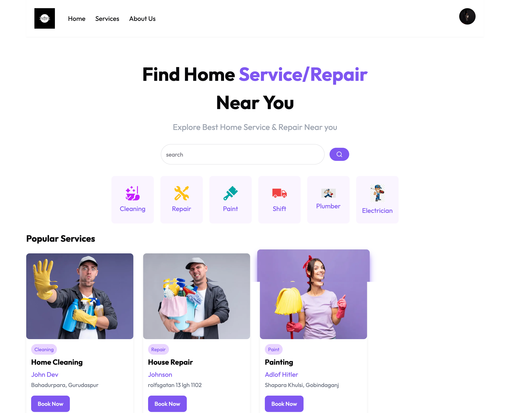

<div align="center">



<h1>FixItNow</h1>
<p><strong>A full-stack home-services marketplace built with Next.js 14.</strong><br/>
Discover trusted local professionals, see real-time availability, and book appointments in seconds.</p>

</div>

---

## Table of contents

1. [About](#about)
2. [Tech stack](#tech-stack)
3. [Features](#features)
4. [Architecture](#architecture)
5. [Project structure](#project-structure)
6. [Quick start](#quick-start)
7. [Environment variables](#environment-variables)
8. [Running with Docker](#running-with-docker)
9. [Testing & quality](#testing--quality)
10. [CI/CD](#cicd)
11. [Roadmap](#roadmap)
12. [License](#license)

---

## About

FixItNow is a production-style web application that connects homeowners with verified service providers — cleaning, plumbing, electrical, repairs and more. It is built around the **Next.js 14 App Router**, uses **server-side rendering** for SEO and performance, and is fully containerised so it can run identically on a laptop, a CI runner, or a production host.

The project is intentionally structured the way a small product team would build it: feature-folder routing, a thin service layer that wraps the data source, protected routes via middleware, error/loading boundaries, accessible components, and an opinionated CI pipeline.

## Tech stack

| Layer            | Choice                                                           |
| ---------------- | ---------------------------------------------------------------- |
| Framework        | Next.js 14 (App Router) + React 18                               |
| Styling          | Tailwind CSS, shadcn/ui (Radix primitives), Lucide icons         |
| Auth             | NextAuth.js with a Descope OIDC provider                         |
| Data (today)     | Hygraph (headless GraphQL CMS) via `graphql-request`             |
| Notifications    | Sonner (toast)                                                   |
| Theming          | `next-themes` (system / light / dark)                            |
| Containerisation | Docker (multi-stage production build) & Docker Compose (dev)     |
| CI/CD            | GitHub Actions (lint + build + Docker image), Jenkinsfile        |
| Tooling          | ESLint, Prettier, Husky (planned in Phase 1: TypeScript + tests) |

## Features

- **Browse services** by category with skeleton loading states.
- **Search** for services from the homepage hero.
- **Service detail page** with description, gallery, contact info, and a similar-businesses sidebar.
- **Real-time booking sheet**: choose a date and an available time slot; already-booked slots are disabled.
- **My bookings** dashboard split into upcoming / past, fully filtered on the client.
- **Authentication** via Descope (OIDC) with refresh-token rotation in the NextAuth JWT callback.
- **Protected routes** (`/mybooking`, `/details/*`) enforced by Next.js middleware.
- **Theme toggle** (light / dark / system) backed by `next-themes`.
- **Accessibility**: semantic HTML, ARIA labels, focus-visible styles, alt text, keyboard-navigable menus.
- **SEO**: per-page metadata, OpenGraph, Twitter cards, image domains whitelisted via `remotePatterns`.
- **Error boundaries**: dedicated `loading.js`, `error.js`, and `not-found.js` at the app level.

## Architecture

```mermaid
flowchart LR
    User[Browser] -->|HTTPS| Next[Next.js 14 (App Router)]
    Next -->|GraphQL| Hygraph[(Hygraph CMS)]
    Next -->|OIDC| Descope[Descope Auth]
    Next -->|JWT session| User
```

Today the data layer is a hosted CMS (Hygraph). In the upcoming **Phase 2** the project will be split into a monorepo and Hygraph will be replaced by a custom **Express + MongoDB + Redis** API written in TypeScript, with JWT auth, Zod validation, Swagger docs, Pino logs, and Supertest integration tests.

## Project structure

```
.
├── app/
│   ├── _components/             # Header, Hero, Footer, ThemeToggle, lists
│   ├── _services/               # GlobalApi.js — single source of truth for data calls
│   ├── (routes)/
│   │   ├── details/[businessId]/page.jsx
│   │   ├── mybooking/page.jsx
│   │   └── search/[category]/page.jsx
│   ├── about/page.jsx
│   ├── api/auth/[...nextauth]/route.js
│   ├── error.js / loading.js / not-found.js
│   ├── layout.js / page.js / provider.js
│   └── globals.css
├── components/ui/               # shadcn primitives
├── lib/utils.js                 # cn() helper
├── public/                      # Static assets (logo, screenshots)
├── middleware.js                # Route protection
├── next.config.mjs              # Standalone output, image remote patterns
├── tailwind.config.js / postcss.config.js / components.json
├── Dockerfile                   # Multi-stage production image
├── Dockerfile.dev               # Development image used by docker-compose
├── docker-compose.yml
├── Jenkinsfile
├── .github/workflows/ci.yml
└── .env.example
```

## Quick start

### Prerequisites

- Node.js **>= 18.17** (Node 20 recommended)
- npm 9+
- (Optional) Docker Desktop

### Install & run

```bash
git clone https://github.com/Sachinrajawat/FixItNow.git
cd FixItNow
cp .env.example .env       # then fill in real values
npm install
npm run dev                # http://localhost:3000
```

### Other useful scripts

```bash
npm run lint           # ESLint
npm run lint:fix       # Auto-fix lint issues
npm run format         # Prettier check
npm run format:fix     # Prettier write
npm run build          # Production build
npm start              # Run the production build locally
npm run docker:dev     # docker compose up --build
npm run docker:prod    # Build & run the production image
```

## Environment variables

| Variable                     | Required | Description                                             |
| ---------------------------- | :------: | ------------------------------------------------------- |
| `NEXT_PUBLIC_SITE_URL`       |    no    | Used for SEO/OpenGraph (`metadataBase`).                |
| `NEXT_PUBLIC_MASTER_URL_KEY` |   yes    | Hygraph project ID portion of the GraphQL endpoint.     |
| `DESCOPE_CLIENT_ID`          |   yes    | Descope OIDC client id.                                 |
| `DESCOPE_CLIENT_SECRET`      |   yes    | Descope OIDC client secret.                             |
| `NEXTAUTH_SECRET`            |   yes    | NextAuth JWT signing secret. `openssl rand -base64 32`. |
| `NEXTAUTH_URL`               |   yes    | Public URL of the app (e.g. `http://localhost:3000`).   |

A complete template lives in [`.env.example`](./.env.example).

## Running with Docker

**Development** (hot reload):

```bash
docker compose up --build
```

**Production** (multi-stage standalone build, ~150 MB image, runs as non-root with a healthcheck):

```bash
docker build -t fixitnow:latest .
docker run -p 3000:3000 --env-file .env fixitnow:latest
```

## Testing & quality

- **Lint**: ESLint via `next lint`. Run `npm run lint`.
- **Format**: Prettier with `prettier-plugin-tailwindcss`. Run `npm run format:fix`.
- **Tests**: Vitest + React Testing Library will be added in **Phase 1**.
- **Type safety**: TypeScript migration planned in **Phase 1**.

## CI/CD

[`.github/workflows/ci.yml`](./.github/workflows/ci.yml) runs on every push & PR to `main`:

1. `npm ci`
2. `npm run lint`
3. `npm test --if-present`
4. `npm run build` (with placeholder secrets injected from GitHub Secrets)
5. On `main` only: build the production Docker image (with build cache).

A [`Jenkinsfile`](./Jenkinsfile) mirrors the pipeline for self-hosted Jenkins users.

## Roadmap

This project is being delivered in clear phases (see the original walkthrough for full context):

- [x] **Phase 0 — Cleanup**: bug fixes, real metadata, footer, theme toggle, working search, route protection, multi-stage Docker, modern CI.
- [ ] **Phase 1 — TS & quality**: TypeScript migration, ESLint/Prettier/Husky/lint-staged, env validation with Zod, Vitest + React Testing Library, Sentry.
- [ ] **Phase 2 — Real backend**: monorepo split (`apps/web` + `apps/api` + `packages/types`). Express + MongoDB + Mongoose + Redis API in TypeScript, JWT auth (access + refresh, httpOnly cookies), Zod request validation, Swagger UI, Pino logs, Supertest integration tests. Hygraph removed.
- [ ] **Phase 3 — Headline features**: reviews & ratings, Stripe (test mode) payments, geo-search, admin dashboard with RBAC, email confirmations, BullMQ background jobs.
- [ ] **Phase 4 — Polish & deploy**: per-page SEO metadata, sitemap, robots, JSON-LD, accessibility audit, performance budget, deployment to Vercel + Render + MongoDB Atlas, screenshots, architecture diagram, demo video.

## License

[MIT](./LICENSE) © Sachin Rajawat
