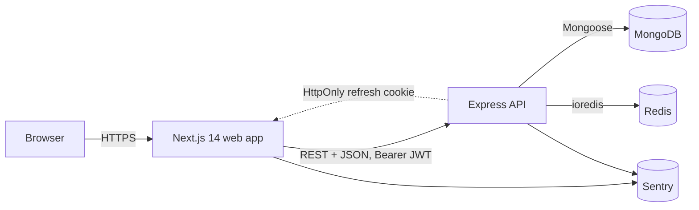

<div align="center">


<h1>FixItNow</h1>
<p><strong>A production-shaped home-services marketplace.</strong><br/>
TypeScript end-to-end. Next.js 14 web, Express + Mongoose + Redis API, shared Zod schemas.</p>

<p>
  <a href="https://fix-it-now-web-in9h.vercel.app"><strong>Live demo</strong></a>
  &nbsp;·&nbsp;
  <a href="https://fixitnow-api.onrender.com/api/docs"><strong>API docs</strong></a>
  &nbsp;·&nbsp;
  <a href="./DEPLOY.md">Deploy guide</a>
</p>

</div>

> **Demo accounts** (seeded — rotate before reuse):
> <br/>• Admin: `admin@fixitnow.dev` / `Admin#12345`
> <br/>• Customer: `demo@fixitnow.dev` / `Demo#12345`
> <br/>• Business owner: `owner@fixitnow.dev` / `Owner#12345`

---

## What it does

A homeowner pastes a category or a free-text query, gets a list of nearby
services (filterable by `?near=lng,lat&radius=`), opens a business profile
with photos and reviews, picks a free time slot, books it, and manages
everything from a "My bookings" tab. Owners list businesses; admins manage
the catalog.

| Feature                                                                                    | Status     |
| ------------------------------------------------------------------------------------------ | ---------- |
| Auth (signup, login, refresh, logout) — JWT access + rotating refresh on a Redis allowlist | ✅         |
| Categories CRUD with Redis cache-aside + invalidation                                      | ✅         |
| Businesses CRUD with text search, category filter, pagination, and 2dsphere geo search     | ✅         |
| Bookings (create / list-mine / cancel) — race-safe double-booking prevention               | ✅         |
| Reviews with idempotent `ratingAvg` / `ratingCount` aggregation                            | ✅         |
| Optimistic UI for ratings on the details page                                              | ✅         |
| `/admin/categories` dashboard with RBAC (admin role gate end-to-end)                       | ✅         |
| SEO: dynamic sitemap, robots, `LocalBusiness` JSON-LD on `/details/[id]`                   | ✅         |
| Auto-generated OpenAPI 3.0 from the shared Zod schemas, served at `/api/docs`              | ✅         |
| Stripe test-mode payments, email confirmations, BullMQ jobs                                | 🔜 roadmap |

## Architecture



Three workspaces in one repo (`apps/web`, `apps/api`, `packages/types`). The shared
`@fixitnow/types` package holds the Zod schemas both sides use — so HTTP payload
shapes can never drift between client and server.

## Engineering decisions worth calling out

These are the trade-offs that shape the codebase. Each is documented inline at the relevant file.

- **Zod as the single source of truth.** 35+ Zod schemas in `packages/types` power
  Express request validation, react-hook-form resolvers on the client, _and_ an
  auto-generated OpenAPI 3.0 spec via `zod-to-openapi`. Adding a field to a schema
  reflects everywhere; the `/api/docs` page cannot fall out of sync.

- **Stateless JWT auth with a Redis allowlist.** Access tokens (15 min) are held
  in memory only — never `localStorage`, so XSS can't exfiltrate. Refresh tokens
  (7 d, HttpOnly cookie) are _single-use_: each `/auth/refresh` does an atomic
  Redis `DEL` of the consumed `jti`, so a stolen cookie buys exactly one window
  before the legitimate user's next refresh invalidates the chain. Logout `SCAN`s
  - `DEL`s every key under `refresh:{userId}:*` for global revocation.

- **Race-safe double-booking via a _partial_ unique index.** The `Booking`
  collection has a unique index on `(business, date, time)` filtered to
  `status: "booked"`. Two concurrent insert attempts collide on Mongo E11000 →
  the controller maps that to a typed `409 Conflict`. Cancellations don't free
  the slot by deletion — the row stays as `cancelled` — so audit history is
  preserved AND the slot is immediately rebookable.

- **Idempotent rating aggregates.** Every review create/delete recomputes
  `ratingAvg` (1-decimal rounded) and `ratingCount` on the parent Business with
  a single `$group` aggregation. Idempotent by construction, so no transaction
  needed — rerunning over the same review set always yields the same numbers.
  The web side recomputes locally with the same rounding for instant
  optimistic UI; the server reconciles on the next page load.

- **Single-flight refresh on the typed API client.** A burst of concurrent 401s
  triggers exactly one `/auth/refresh` call — all in-flight callers wait on the
  same promise. Every request method accepts an `AbortSignal` so React effects
  cancel cleanly on unmount. Surfaces a typed `ApiError` mirroring the
  server's standard envelope, so callers branch on `err.status === 409` rather
  than regexing strings.

- **Redis cache-aside that fails open.** GET `/categories` and GET `/businesses`
  are cached with a 60s TTL keyed by the query string. Every mutation prefix-
  invalidates via non-blocking `SCAN`. Any Redis error → request goes through
  unaffected. A degraded cache never cascades into application downtime.

## Tech stack

| Layer                     | Choice                                                                                |
| ------------------------- | ------------------------------------------------------------------------------------- |
| Language                  | **TypeScript**, strict mode, end-to-end                                               |
| Frontend                  | Next.js 14 (App Router), React 18, Tailwind, shadcn/ui                                |
| Backend                   | Express 4, Mongoose 8, ioredis, Pino, Helmet, cors, compression                       |
| Validation & API contract | Zod via shared `@fixitnow/types` workspace, OpenAPI via `zod-to-openapi`              |
| Forms                     | react-hook-form + `@hookform/resolvers/zod`                                           |
| Auth                      | JWT access + rotating refresh tokens, Redis allowlist, bcrypt-hashed passwords        |
| Testing                   | Jest + Supertest + MongoMemoryServer + ioredis-mock (api); Vitest + RTL + jsdom (web) |
| Tooling                   | ESLint, Prettier, Husky, lint-staged                                                  |
| Containerization          | Multi-stage Docker for both apps, Docker Compose for local dev                        |
| CI/CD                     | GitHub Actions (format / lint / typecheck / test / build / Docker)                    |
| Production                | Vercel + Render + MongoDB Atlas + Upstash Redis (all free tier)                       |

## Quick start

```bash
git clone https://github.com/Sachinrajawat/FixItNow.git
cd FixItNow
npm install
cp apps/web/.env.example apps/web/.env.local  # NEXT_PUBLIC_API_URL=http://localhost:4000
cp apps/api/.env.example apps/api/.env        # MONGO_URI / REDIS_URL / JWT_* secrets

# Bring up Mongo + Redis (host ports 27018 and 6380 to avoid clashes)
docker compose up mongo redis -d

# Seed realistic data: 8 categories, 12 businesses, 3 demo users, 5 reviews
npm run seed --workspace @fixitnow/api

# Run the apps
npm run dev:api    # http://localhost:4000  (API + /api/docs)
npm run dev:web    # http://localhost:3000  (Next.js)
```

Sign up with any email or use the seeded admin (`admin@fixitnow.dev` / `Admin#12345`).

## Quality bar

```
typecheck   3 / 3 workspaces clean (tsc --noEmit, strict everywhere)
lint        ESLint + next lint clean
prettier    workspace-wide format check
tests       59 api + 49 web = 108 passing
build       both production builds green; 13 routes emitted
```

CI runs format → lint → typecheck → test → build on every push and PR.
On `main` it also builds production Docker images for both apps with
Buildx layer caching.

## Deployment

The repo is deploy-ready for a free-tier production stack: Vercel for the
web, Render (with the `render.yaml` blueprint) for the API, MongoDB Atlas,
Upstash Redis. See [DEPLOY.md](./DEPLOY.md) for the step-by-step.

## Roadmap

- `/admin/businesses` and `/admin/bookings` dashboards (same patterns as `/admin/categories`)
- Stripe test-mode payments on booking confirmation with webhook idempotency
- BullMQ background jobs (booking expiry, email confirmations, weekly digests)
- Per-page `generateMetadata` on `/details/[id]` and `/search/[category]` for richer SEO
- Playwright end-to-end smoke for the signup → book → cancel flow
- Lighthouse CI / performance budget in the workflow

## License

[MIT](./LICENSE) © Sachin Rajawat
