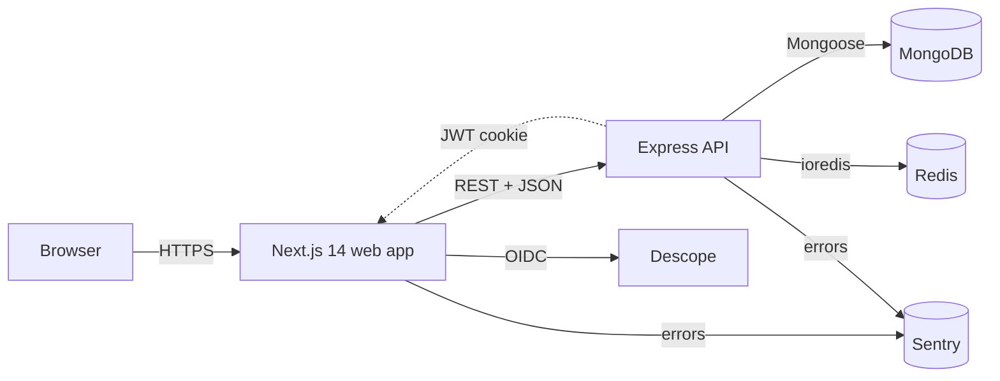

<div align="center">


<h1>FixItNow</h1>
<p><strong>A full-stack home-services marketplace.</strong><br/>
Next.js 14 frontend, Express + MongoDB + Redis backend, all in TypeScript.</p>

</div>

---

## Table of contents

1. [About](#about)
2. [Architecture](#architecture)
3. [Monorepo layout](#monorepo-layout)
4. [Tech stack](#tech-stack)
5. [Quick start](#quick-start)
6. [Environment variables](#environment-variables)
7. [Useful scripts](#useful-scripts)
8. [Running with Docker](#running-with-docker)
9. [Testing & quality](#testing--quality)
10. [CI/CD](#cicd)
11. [Roadmap](#roadmap)
12. [License](#license)

---

## About

FixItNow connects homeowners with verified service providers — cleaning, plumbing, electrical, repairs and more. The codebase is intentionally structured the way a small product team would build it: feature-folder routing, a thin service layer, layered backend architecture, route protection via middleware, error/loading boundaries, accessibility, observability, and an opinionated CI pipeline.

It is split into two deployable apps that share a single source of truth for their domain types.

## Architecture



Both apps import their domain types and request/response Zod schemas from the shared `@fixitnow/types` workspace package, so the types of HTTP payloads can never drift between client and server.

## Monorepo layout

```
fixitnow/
├── apps/
│   ├── web/                 @fixitnow/web — Next.js 14 frontend (TypeScript)
│   │   ├── app/             App Router (routes, layout, error/loading boundaries)
│   │   ├── components/ui/   shadcn primitives (TS)
│   │   ├── lib/             cn(), env (zod-validated)
│   │   ├── middleware.ts    Route protection
│   │   ├── sentry.*.config.ts
│   │   └── ...
│   └── api/                 @fixitnow/api — Express + Mongoose + Redis (TypeScript)
│       ├── src/
│       │   ├── config/      env (zod), logger (pino), db, redis
│       │   ├── middlewares/ requestId, validate(), errorHandler
│       │   ├── routes/      Routers (health, …)
│       │   ├── utils/       AppError
│       │   ├── openapi.ts   OpenAPI 3.0 spec served at /api/docs
│       │   ├── app.ts       Express app factory (no listen)
│       │   └── server.ts    bootstraps connections + listens
│       ├── test/            Jest + Supertest integration tests
│       └── Dockerfile
├── packages/
│   └── types/               @fixitnow/types — shared Zod schemas + TS types
└── docker-compose.yml       Spins up web + api + mongo + redis
```

## Tech stack

| Layer            | Choice                                                                   |
| ---------------- | ------------------------------------------------------------------------ |
| Language         | **TypeScript** (strict) end-to-end                                       |
| Frontend         | Next.js 14 (App Router), React 18, Tailwind CSS, shadcn/ui, Lucide icons |
| Backend          | Express 4, Mongoose 8, ioredis, Pino, Helmet, cors, compression          |
| Validation       | Zod (shared `@fixitnow/types` workspace)                                 |
| API docs         | OpenAPI 3.0 + Swagger UI at `/api/docs`                                  |
| Auth (web)       | NextAuth.js with a Descope OIDC provider                                 |
| Auth (api)       | JWT access + refresh (Phase 2 Step 2)                                    |
| Tests            | Vitest + RTL + jsdom (web), Jest + Supertest (api)                       |
| Observability    | Sentry (client + server + edge), structured logs with request id         |
| Tooling          | ESLint, Prettier, Husky + lint-staged                                    |
| Containerisation | Docker (multi-stage prod images), Docker Compose for local stack         |
| CI/CD            | GitHub Actions, Jenkinsfile                                              |

## Quick start

### Prerequisites

- Node.js **>= 18.17** (Node 20 recommended), npm 9+
- (Optional) Docker Desktop — easiest way to run Mongo + Redis locally

### Install everything

```bash
git clone https://github.com/Sachinrajawat/FixItNow.git
cd FixItNow
npm install                     # installs all workspaces
cp apps/web/.env.example apps/web/.env.local
cp apps/api/.env.example apps/api/.env
```

### Run the dev stack

The most reliable way is to use Docker for the data layer and run the apps locally:

```bash
# In one terminal — Mongo + Redis
docker compose up mongo redis

# In another terminal — API on :4000
npm run dev:api

# In another terminal — Web on :3000
npm run dev:web
```

…or run everything in containers in one go:

```bash
docker compose up --build
```

## Environment variables

### `apps/web` (`.env.local`)

| Variable                     | Required | Description                                             |
| ---------------------------- | :------: | ------------------------------------------------------- |
| `NEXT_PUBLIC_SITE_URL`       |    no    | Used for SEO/OpenGraph (`metadataBase`).                |
| `NEXT_PUBLIC_API_URL`        |   yes    | Base URL of the API (e.g. `http://localhost:4000`).     |
| `NEXT_PUBLIC_MASTER_URL_KEY` |  yes\*   | Hygraph project id (will be removed in Phase 2 Step 3). |
| `DESCOPE_CLIENT_ID`          |  yes\*   | Descope OIDC client id.                                 |
| `DESCOPE_CLIENT_SECRET`      |  yes\*   | Descope OIDC client secret.                             |
| `NEXTAUTH_SECRET`            |   yes    | NextAuth JWT signing secret. ≥ 16 chars.                |
| `NEXTAUTH_URL`               |   yes    | Public URL of the web app.                              |
| `NEXT_PUBLIC_SENTRY_DSN`     |    no    | Optional client-side Sentry DSN.                        |

\* Hygraph + Descope are temporary — Phase 2 Step 3 swaps to the in-house API + JWT auth.

### `apps/api` (`.env`)

| Variable             | Required | Description                                            |
| -------------------- | :------: | ------------------------------------------------------ |
| `NODE_ENV`           |    no    | `development` (default), `test`, or `production`.      |
| `PORT`               |    no    | Default `4000`.                                        |
| `MONGO_URI`          |   yes    | e.g. `mongodb://localhost:27017/fixitnow`.             |
| `REDIS_URL`          |   yes    | e.g. `redis://localhost:6379`.                         |
| `JWT_ACCESS_SECRET`  |   yes    | ≥ 32 chars. Phase 2 Step 2.                            |
| `JWT_REFRESH_SECRET` |   yes    | ≥ 32 chars. Phase 2 Step 2.                            |
| `JWT_ACCESS_TTL`     |    no    | Default `15m`.                                         |
| `JWT_REFRESH_TTL`    |    no    | Default `7d`.                                          |
| `CORS_ORIGIN`        |    no    | Comma-separated list. Default `http://localhost:3000`. |
| `LOG_LEVEL`          |    no    | `info` (default) / `debug` / `warn` / etc.             |
| `SENTRY_DSN`         |    no    | Optional server-side Sentry DSN.                       |

## Useful scripts

All scripts run at the repo root and use npm workspaces under the hood.

```bash
npm install                # one-shot install for every workspace
npm run dev                # runs every workspace's dev script in parallel
npm run dev:web            # web only
npm run dev:api            # api only
npm run build              # builds every workspace
npm run build:web          # web only
npm run build:api          # api only
npm run lint               # lint every workspace
npm run typecheck          # tsc --noEmit in every workspace
npm test                   # vitest (web) + jest (api)
npm run format             # Prettier check
npm run format:fix         # Prettier write
npm run docker:dev         # docker compose up --build
```

## Running with Docker

```bash
docker compose up --build
```

This brings up four services:

| Service | Port  | Description                              |
| ------- | ----- | ---------------------------------------- |
| `mongo` | 27017 | MongoDB 7 with a named volume            |
| `redis` | 6379  | Redis 7 (alpine)                         |
| `api`   | 4000  | `@fixitnow/api` (multi-stage prod image) |
| `web`   | 3000  | `@fixitnow/web` (dev container)          |

Health checks are configured on Mongo and Redis so `api` waits for them before starting.

## Testing & quality

- **Type safety** — `npm run typecheck` runs `tsc --noEmit` in every workspace (strict mode everywhere).
- **Lint** — `npm run lint` runs `next lint` in `web` and `eslint` (with `@typescript-eslint`) in `api`.
- **Format** — `npm run format` / `npm run format:fix` (Prettier + `prettier-plugin-tailwindcss`).
- **Web tests** — Vitest + React Testing Library + jsdom. `npm run test:coverage` for HTML coverage.
- **API tests** — Jest + Supertest, with `--forceExit` so dangling Redis/Mongo handles never hang CI.
- **Pre-commit** — Husky runs `lint-staged` (Prettier --write on staged files).
- **Pre-push** — Husky runs `npm run typecheck`.

## CI/CD

[`.github/workflows/ci.yml`](./.github/workflows/ci.yml) runs on every push & PR to `main`:

1. `npm ci` (workspaces)
2. `npm run format`
3. `npm run lint`
4. `npm run typecheck`
5. `npm test`
6. `npm run build:web` and `npm run build:api`
7. On `main` only: build production Docker images for both apps with Buildx layer caching.

A [`Jenkinsfile`](./Jenkinsfile) mirrors the pipeline for self-hosted Jenkins users.

## Roadmap

- [x] **Phase 0 — Cleanup**: bug fixes, real metadata, footer, theme toggle, working search, route protection, multi-stage Docker, modern CI.
- [x] **Phase 1 — TS & quality**: TypeScript migration (strict), ESLint/Prettier/Husky/lint-staged, env validation with Zod, Vitest + React Testing Library, Sentry.
- [x] **Phase 2, Step 1 — Monorepo + API skeleton**: npm workspaces (`apps/web`, `apps/api`, `packages/types`); Express + TS + MongoDB + Redis API with health probes, request id, structured logging, Helmet, cors, validation middleware, AppError, Swagger UI; first integration tests with Jest + Supertest; Docker compose stack with mongo + redis + api + web.
- [ ] **Phase 2, Step 2 — Auth & models**: User/Category/Business/Booking/Review Mongoose models with proper indexes; JWT access + refresh with Redis allowlist; protected routes; tests against MongoMemoryServer.
- [ ] **Phase 2, Step 3 — Endpoints & web migration**: full CRUD endpoints; Redis caching; rate limiting; seed script; remove Hygraph from `apps/web` and rewire to `apps/api`.
- [ ] **Phase 3 — Headline features**: reviews & ratings, Stripe (test mode) payments, geo-search, admin dashboard with RBAC, email confirmations, BullMQ background jobs.
- [ ] **Phase 4 — Polish & deploy**: per-page SEO metadata, sitemap, robots, JSON-LD, accessibility audit, performance budget, deployment to Vercel + Render + MongoDB Atlas, screenshots, architecture diagram, demo video.

## License

[MIT](./LICENSE) © Sachin Rajawat
